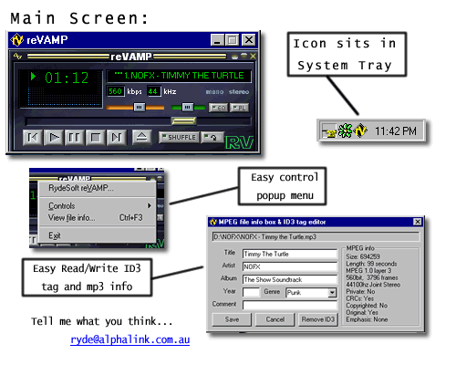



## reVamp \- WinAmp Clone\(fixed\)

### Description

NOTE: This one Works (sorry 'bout last one)  

reVamp is a Winamp clone made in Visual Basic 6 

It's Current Features are:  

* Winamp style Interface  

* Sliding Progress/Volume/Balance bars  

* Clickable Progress/Volume/Balance bars  

* Tells % of Volume/Balance  

* Full Read/Write ID3 tag Info  

* Song duration Progress Bar (can click/slide)  

* System tray icon (easy control)  

* Moving name plate    

This was basically just for fun, not for people to use, Naturally Winamp is better. I am yet to add a Playlist window due to the fact i didn't know if it was worth all the trouble. If people like it and want me to add it in, then just tell me and it'll be done :)  

You can also vote for me if you think it's good.
 
### More Info
 

             |
---                |---
**Submitted On**   |2000-12-15 18:04:50
**By**             |[Chris Rickard](https://github.com/Planet-Source-Code/PSCIndex/blob/master/ByAuthor/chris-rickard.md)
**Level**          |Advanced
**User Rating**    |3.8 (19 globes from 5 users)
**Compatibility**  |VB 4\.0 \(16\-bit\), VB 4\.0 \(32\-bit\), VB 5\.0, VB 6\.0
**Category**       |[Sound/MP3](https://github.com/Planet-Source-Code/PSCIndex/blob/master/ByCategory/sound-mp3__1-45.md)
**World**          |[Visual Basic](https://github.com/Planet-Source-Code/PSCIndex/blob/master/ByWorld/visual-basic.md)
**Archive File**   |[CODE\_UPLOAD1271012152000\.zip](https://github.com/Planet-Source-Code/chris-rickard-revamp-winamp-clone-fixed__1-13607/archive/master.zip)

